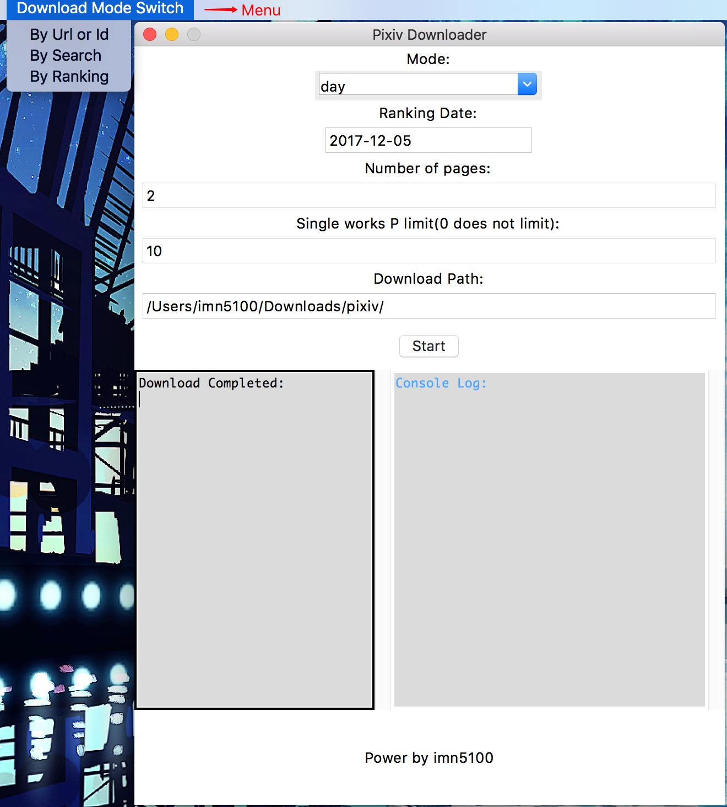

# PixivDownloader
Pixiv And Pixivision Illustrations Downloader. 
 
* 项目主要用于 Pixiv站和Pixivision的插画特辑信息爬取和图片下载 
      	支持以下下载方式： 
          1.  Pixivision插画特辑列表页全部爬取 
          2.  Pixivision插画特辑详情页全部爬取 
          3.  通过Pixiv插画url下载 
          4.  通过Pixiv插画ID下载 
          5.  通过关键字搜索下载 
           6.  排行榜下载 

启动图形界面下载工具:(支持下载方式1-6) 
使用方式：1.直接启动，输入Pixiv用户名和密码(如果有配置会自动填充)，验证通过直接进入下载界面。2.配置ACCESS_TOKEN和PIXIV_COOKIES(每次使用用户名和密码登录时控制台会输出)，验证通过后(时间可能略长),直接进入下载界面。
~~~
python launcher_gui.py
~~~

运行Pixivision全站插画爬虫: 
&nbsp;&nbsp;&nbsp;&nbsp;全站爬取完毕后，如果Pixivsion有更新，可以修改配置文件中的PAGE_NUM为更新的页数，比如Pixivsion有2页更新未爬取，修改PAGE_NUM=2,全站插画爬虫则会爬取前2页的所有特辑
~~~
python launcher_pixivision.py
~~~
运行Pixivision插画特辑补全脚本： 
&nbsp;&nbsp;&nbsp;&nbsp;用于检查从Pixivision下载的特辑是否完全下载完毕，文件是否完整，并补全下载。(注意：这里的补全并不是下载Pixivison的更新的内容)
~~~
python launcher_check_completion.py
~~~
Pixiv Api代码参考了[pixivpy](https://github.com/upbit/pixivpy "pixivpy") 
运行需求：python2.7(3以上版本暂未测试) 必要扩展库：future,requests(用于网页爬取,api请求),BeautifulSoup(用于网页html数据解析) 
非必要扩展库： 
&nbsp;twisted 如果需要运行launcher_pixivision.py,使用twisted线程池管理下载可以获取更快下载速度。 
&nbsp;Pillow  可检查Pixivision下载的插画文件是否完整。  

UPDATE: 
2017.05.11  新增项目目录外的配置文件config.ini,避免更新代码后原配置被覆盖 
2017.05.24  添加了一个简单的图形界面下载工具 
2017.06.20  完善图像界面下载工具,支持通过关键字搜索下载插画 
2017.07.06  由于Pixiv Api更新,原本拉取插画详情的接口需要登录才能使用,直接使用控制台命令下载时,Pixiv账号和密码设置变为必填项。 
2017.07.16  Pixivision专辑页支持多图下载，所有下载图片默认为原图画质 
2017.07.27  Pixivision补全脚本,新增检查文件完整性：需要修改配置：CHECK_IMAGE_VERIFY=True 并安装 Pillow 生效 
2017.08.03  图形界面下载工具需要登录或配置Token和Cookie才能启动下载界面 
2017.08.31  优化图形界面下载工具的搜索下载，同时使用网页搜索爬虫和API搜索搜集下载数据 
2017.09.02  图形界面下载工具新增排行榜下载 
2017.09.22  Pixiv因DNS污染，部分地区无法直接访问。需要修改DNS或hosts文件才能正常使用。hosts文件修改:复制[pixiv_host](readmeFile/pixiv_host.txt)内容到hosts中 

PS①:推荐直接使用图形界面下载工具下载 

PS②:关于搜索下载，在没有高级会员账号的情况下，很难搜到高质量的人气作品。 
常见的做法：在关键字后加 1000users入り ，即"1000以上用户收藏"，表示搜索tag中或描述中包含关键字"1000users入り"，1000可替换为其他数值。
这样搜出来的作品的确能基本保证是人气作品，但只对大类目有效（比如東方project,艦これ 这类搜索）且会遗漏很多优秀作品,小类目的作品则会一幅都搜不出。 
&nbsp;&nbsp;&nbsp;&nbsp;在使用小类目搜索下载时，你可以尝试以下方法下载人气作品： 
&nbsp;&nbsp;&nbsp;&nbsp;&nbsp;&nbsp;1.增加爬取页数。  
&nbsp;&nbsp;&nbsp;&nbsp;&nbsp;&nbsp;2.适当调小——下载的插画的最小收藏数的设置。 
&nbsp;&nbsp;&nbsp;&nbsp;&nbsp;&nbsp;3.减小搜索关键字范围。  

PS③:如果出现了在控制台运行输入中文||日文出现字符编码异常情况，请设置控制台运行环境字符编码为UTF-8后重试。Windows系统下推荐直接使用IDE运行,或直接使用图形界面下载工具。
